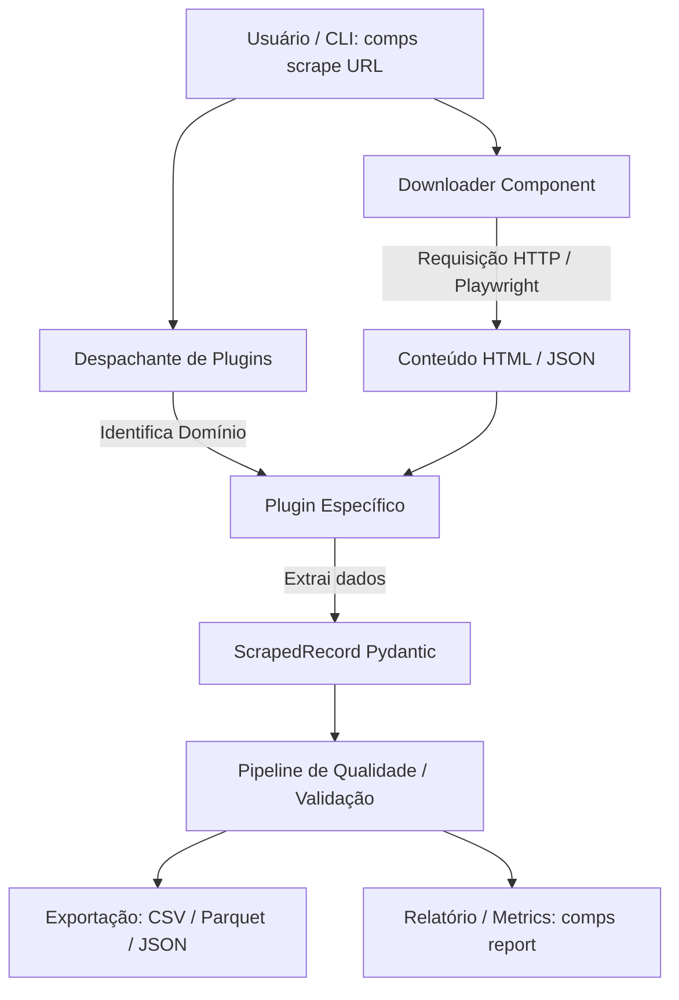

# O que sou? 🦕


[](https://github.com/elycbarros/compsognathus/actions/workflows/tests.yml)

> **Compsognathus** (ou simplesmente **`comps`**) v1.3.1 é um framework e CLI de web scraping em Python orientado a plugins.
> 
> Ele cuida da infraestrutura complexa e repetitiva da raspagem de dados — downloads HTTP/headless, gestão de taxas e retentativas, validação de esquema, auditoria de qualidade e exportação — para que você foque apenas na lógica de extração da página alvo.

---

## 🎯 O Propósito do Projeto

Na raspagem de dados para análise de mercado ou ciência de dados, criar scripts avulsos cria rapidamente um pesadelo de manutenção: retentativas ad-hoc, concorrência descontrolada, formatos de saída inconsistentes e código repetido.

O **Compsognathus** resolve isso através de **separação clara de responsabilidades**:
- **O Framework (`comps`)** lida com a infraestrutura: rede, resiliência, validação, relatórios e exportação.
- **Os Plugins** contêm apenas a regra de parsing específica de cada site ou domínio.

Inspirado no pequeno dinossauro ágil e veloz, o `comps` é leve, extensível e projetado tanto para uso real quanto como projeto demonstrativo de alta qualidade técnica em engenharia de dados.

---

## 💡 Visão Geral Técnica & Decisões de Engenharia

Para entender este repositório sob a ótica de engenharia de software e arquitetura de dados, vale destacar as principais decisões de design adotadas:

1. **Padrão de Plugin & Despacho Dinâmico (*Strategy Pattern*)**:
   - Em vez de um grande arquivo monolítico com múltiplos `if/else`, cada site suportado é um módulo isolado.
   - O framework descobre e despacha a requisição para o plugin correto com base na URL do alvo, garantindo desacoplamento total.

2. **Resiliência Multi-Camada**:
   - **Download Adaptativo**: Alterna automaticamente entre requisições HTTP estáticas via `httpx` (para máxima performance) e navegadores headless via `playwright` (quando a página exige execução de JS).
   - **Retentativas Inteligentes**: Utiliza *exponential backoff* com *jitter* via `tenacity` para evitar ser bloqueado por *rate limiting*.
   - **Tratamento Gracioso de Erros**: Falhas de parsing em itens individuais não interrompem o lote todo; em vez disso, são registradas no pipeline de auditoria.

3. **Contratos Fortes e Qualidade de Dados**:
   - Uso de schemas **Pydantic v2** para garantir a estrutura do `ScrapedRecord`. Se o HTML do site mudar e um campo essencial desaparecer, a falha é capturada e reportada imediatamente pelo comando `comps validate`.

4. **Foco em Testabilidade & DX (Developer Experience)**:
   - **Automação de Boilerplate**: O comando `comps plugins new` gera toda a estrutura necessária para um novo site (plugin, teste e fixture de mock HTML) em um único passo.
   - **Testes Offline**: A suíte com mais de 80 testes roda 100% offline utilizando fixtures salvas localmente, tornando o CI extremamente rápido e determinístico.


---

## ⚙️ Arquitetura & Tecnologias Utilizadas (Tech Stack)

### 🧱 Tecnologias Core

| Categoria | Tecnologia | Função no Projeto |
| :--- | :--- | :--- |
| **Linguagem** | **Python 3.11+** (suporte até 3.14) | Base do projeto com tipagem estática moderna (`typing`). |
| **Interface CLI** | **Typer** + **Rich** | Interface de linha de comando elegante, com tabelas coloridas, barras de progresso e diagnósticos visuais. |
| **Downloader & Rede** | **HTTPX** (com HTTP/2) | Cliente HTTP ultrarrápido com suporte a HTTP/2 para páginas estáticas e APIs. |
| **Navegador Headless**| **Playwright** | Automação e renderização de navegadores (Chromium) para Single Page Applications (SPAs) e conteúdo gerado por JavaScript. |
| **Parsing HTML** | **BeautifulSoup 4** | Extração de dados da árvore DOM em HTML estático e fragmentos trazidos por scripts. |
| **Schemas & Contratos**| **Pydantic v2** | Definição de contratos de dados estruturados (`ScrapedRecord`), coerção de tipos e validação estrita. |
| **Resiliência** | **Tenacity** | Sistema de retentativas configurável com *exponential backoff* e *jitter* para evitar bloqueios de taxa (*rate limiting*). |
| **Processamento de Dados**| **Pandas** + **PyArrow** | Manipulação tabular de dados e serialização rápida em **CSV**, **Parquet**, **JSON** e **JSONL**. |
| **Testes & Qualidade** | **Pytest** + **Ruff** + **CI** | 81+ testes automatizados (80%+ de cobertura) e linters para garantia de qualidade no GitHub Actions. |

---

## 🔄 Como Funciona a Pipeline



1. **Despacho Automático**: Ao rodar `comps scrape <URL>`, o framework identifica qual plugin está registrado para responder àquele domínio.
2. **Download Resiliente**: O `Downloader` realiza a busca do conteúdo tratando retentativas e timeouts de forma uniforme.
3. **Parsing Isolado**: O plugin converte o HTML ou payload JSON em instâncias de `ScrapedRecord`.
4. **Auditoria de Qualidade**: Erros de parsing, links quebrados ou campos nulos são capturados no relatório do dataset sem quebrar a execução global.
5. **Serialização Tabular**: Dados válidos são gravados no formato desejado.

---

## 🚀 Como Usar

### 1. Instalação

```bash
# Clone o repositório
git clone https://github.com/elycbarros/compsognathus.git
cd compsognathus

# Crie e ative um ambiente virtual
python3 -m venv .venv
source .venv/bin/activate

# Instale as dependências (incluindo pacotes de desenvolvimento)
pip install -e .[dev]

# Instale o navegador do Playwright (para alvos dinâmicos)
playwright install chromium
```

---

### 2. Principais Comandos da CLI

O CLI oferece dois caminhos equivalentes: `comps` (curto) ou `compsognathus` (longo).

#### 📥 Executar Raspagem (`scrape`)
```bash
# Raspar uma URL e salvar em Parquet (padrão)
comps scrape "https://exemplo.com/imovel/123"

# Raspar especificando o formato de saída e número de trabalhadores concorrentes
comps scrape "https://exemplo.com/imovel/123" --output dados.csv --concurrency 4
```

#### 🆕 Criar um Novo Plugin (`plugins new`)
O framework possui gerador automático de código para criar novos plugins prontos para uso:
```bash
comps plugins new meu_site "https://meusite.com/item/1"
```
*Isso criará automaticamente o plugin em `compsognathus/plugins/`, a fixture de teste em `tests/fixtures/` e o teste unitário em `tests/`.*

#### 🔍 Diagnosticar Qualidade (`validate`)
Verifique se um dataset gerado possui campos vazios, dados corrompidos ou taxas anômalas de falha:
```bash
comps validate ./output/dataset.parquet
```

#### 📊 Gerar Relatório de Dataset (`report`)
Exiba estatísticas detalhadas sobre o dataset extraído diretamente no terminal:
```bash
comps report ./output/dataset.parquet
```

#### 🧪 Rodar a Suíte de Testes
```bash
# Executar todos os testes
pytest

# Executar com relatório de cobertura de código
pytest --cov=compsognathus
```

---

## 📁 Estrutura do Repositório

```text
compsognathus/
├── compsognathus/            # Código-fonte principal
│   ├── cli.py                # Interface de Linha de Comando (Typer)
│   ├── downloader.py         # Módulo de download (HTTPX + Playwright + Tenacity)
│   ├── core/                 # Classes base, modelos Pydantic e pipeline
│   ├── parsers/              # Parsers utilitários reutilizáveis (JSON-LD, etc.)
│   └── plugins/              # Plugins por domínio (ex: vivareal, zap, etc.)
├── tests/                    # Suíte de 81+ testes automatizados
│   ├── conftest.py           # Fixtures compartilhadas
│   └── test_*.py             # Testes de unidade e integração
├── docs/                     # Documentação e ativos visuais
├── pyproject.toml            # Configuração de build, dependências e ferramentas
├── README.md                 # Visão geral rápida e badges
└── O_QUE_SOU.md              # Este documento explicativo
```

---

## ✨ Por que o Compsognathus se Destaca?

- 🔒 **Tipagem e Contratos Fortes**: Toda extração passa por validação via Pydantic.
- 🧱 **Extensibilidade**: Adicionar suporte a um novo site leva poucos minutos com o comando `comps plugins new`.
- ⚡ **Alta Performance**: Alterna inteligentemente entre requisições HTTP estáticas diretas e renderização via Playwright.
- 💎 **Experiência do Desenvolvedor**: CLI visualmente rica com Rich, tratamento claro de erros e alta cobertura de testes.
