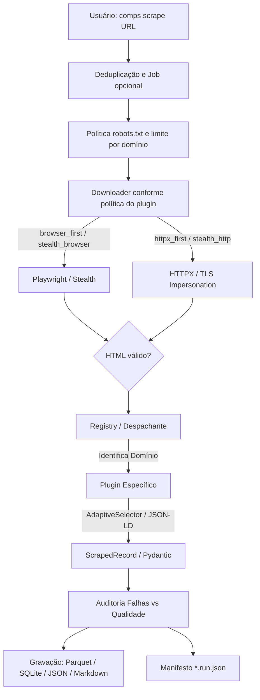

# O que sou? 🦕

> **Compsognathus** (ou simplesmente **`comps`**) é um framework e CLI Python para coleta estruturada e auditável de dados web, orientado a plugins. Este documento descreve a linha arquitetural v1.6.
> 
> Ele cuida da infraestrutura complexa e repetitiva da raspagem de dados — downloads com navegadores headless, fallbacks resilientes HTTP, gestão de taxas e retentativas, validação de esquema via contratos fortes, auditoria de falhas e exportação analítica — para que você foque apenas na lógica de extração da página alvo.

---

## 🎯 A Filosofia e o Problema

Na raspagem de dados para ciência de dados e análises corporativas, a criação de scripts avulsos cria rapidamente um pesadelo de manutenção: fluxos sem retentativas confiáveis, concorrência descontrolada que aciona banimentos, formatos de saída inconsistentes e exceções silenciosas que estragam datasets gigantescos.

O **Compsognathus** se propõe a ser uma base de engenharia de dados, resolvendo essa bagunça através da **separação estrita de responsabilidades**:

- **O Framework (`comps`)** atua como plataforma corporativa leve: gerencia rede, resiliência térmica, validação de contratos (`ScrapedRecord`), relatórios estatísticos e pipeline de escrita de arquivos.
- **Os Plugins** são funções efêmeras que rodam injetadas e contêm puramente a regra de parsing específica de cada site.

Não se trata de uma ferramenta para "invadir" servidores ou contornar medidas severas de segurança de forma hostil. Pelo contrário: é uma fundação organizada, previsível e escalável para uso responsável, tolerando as intempéries transitórias da rede global.

---

## 💡 Decisões Técnicas e Arquitetura

Para entender este repositório sob a ótica de engenharia de software e arquitetura de dados, vale destacar os pilares de design:

### 1. Padrão de Plugin & Despacho Dinâmico (*Strategy Pattern*)

Em vez de um grande monolito (com múltiplos `if/else`), cada site suportado é isolado. O framework utiliza anotações (`@register`) para vincular uma função a um domínio. No momento da execução, a engine extrai a base da URL e despacha o parsing dinamicamente para a estratégia correta, mantendo desacoplamento total. Plugins podem ser bundled no pacote ou descobertos por entry points Python, sem mudar o fluxo principal.

### 2. Resiliência de Download e Evasão Stealth (política por plugin)

O transporte é escolhido pelo plugin conforme a necessidade do domínio, preservando o caminho histórico como padrão:

- **`browser_first` / `browser_only`:** Renderiza o Chromium Headless quando a página depende de JavaScript.
- **`httpx_first` / `httpx_only`:** Usa HTTP direto quando HTML ou JSON-LD estático é suficiente, evitando custo desnecessário.
- **`stealth_browser` / `stealth_http`:** Ativa técnicas de evasão anti-detecção (ocultação de `navigator.webdriver`, emulação de hardware/plugins e camuflagem TLS) para portais com defesas anti-bot rígidas.
- **Resiliência comum:** Tenacity com backoff exponencial, cache opcional, limites por domínio, respeito a `Retry-After` e validação contra páginas de bloqueio.

### 3. Validação, Qualidade e Parsing Adaptativo

Não confiamos em scrapings silenciosos que retornam *None*.
- **Contratos Fortes com Pydantic v2**: Cada `ScrapedRecord` é checado. Se a estrutura falhar, o erro é isolado em `parse_errors` para diagnóstico sem descartar o dataset (`comps validate`).
- **Auto-Healing com `AdaptiveSelector`**: Quando classes CSS mudam dinamicamente (comum em SPAs com Tailwind ou CSS-in-JS), o motor adaptativo localiza os elementos por similaridade estrutural e semântica (`data-*`, `aria-*`, tags e padrões textuais), reduzindo manutenções desnecessárias.

---

## ⚖️ Trade-offs Arquiteturais

| Decisão | Motivação | Trade-off / Preço Pago |
|---|---|---|
| **Plugins por domínio** | Isola as inevitáveis quebras de HTML frequentes de cada site, limitando o raio de ação. | A complexidade horizontal cresce; cada novo domínio exige sua própria função de parsing registrada. |
| **Política de transporte por plugin** | Permite que cada domínio escolha entre renderização, HTTP direto ou modo stealth, mantendo precisão sem desperdiçar recursos. | O contrato do plugin precisa declarar corretamente a necessidade de JavaScript ou stealth. |
| **Preservar registros com falhas** | Um erro em um nó não invalida um lote demorado. Mantém o pipeline de dados limpo para posterior reprocessamento/auditoria. | O dataset final pode incluir valores nulos em colunas essenciais se ignorados, forçando o uso de `comps validate`. |
| **Jobs, cache e manifesto opcionais** | Coletas longas podem ser retomadas e comparadas sem tornar obrigatória uma infraestrutura externa. | O usuário precisa escolher um `--job-dir` quando quiser persistência entre execuções. |
| **Fixtures HTML sintéticas para os testes** | Os testes rodam 100% offline, de forma rápida, previsível, e livre de problemas de rede. | Testes não falharão se o site real for redesenhado; os mocks exigem testes rotineiros complementares no "mundo real". |

---

## ⚙️ A Stack Tecnológica

| Camada | Ferramenta | Responsabilidade |
| :--- | :--- | :--- |
| **Linguagem & Contratos** | Python 3.11+ / Pydantic v2 | Base com *Type Hints* rígidos e validação no tempo de execução. |
| **CLI & UX** | Typer + Rich | CLI imersiva e tipada; terminal colorido com diagnóstico de pipeline. |
| **Rede & Scrape** | Playwright / HTTPX / Tenacity | Política por plugin, modos stealth, retry com backoff, limites por domínio e `robots.txt`. |
| **Parsing & Auto-Healing** | BS4 + `AdaptiveSelector` | Extração estruturada (JSON-LD, Next.js) e seleção resiliente por fingerprint. |
| **Data Engineering & IA** | Pandas + PyArrow | Escrita eficiente (Parquet, SQLite, CSV, JSON Lines e Markdown para RAG/LLMs). |
| **Estado & Extensão** | SQLite / entry points / JSON | Retomada opcional, plugins externos e manifesto auditável por execução. |
| **Qualidade & CI** | Pytest / Ruff / Github Actions | Extensa suíte de testes unitários, de integração e stress rodando offline. |

---

## 🔄 O Fluxo Interno 

## Próximos Passos (Uso)

- Se você quer entender como instalar, rodar e exportar na linha de comando, acesse o passo a passo completo no [**DIDATICO.md**](DIDATICO.md).
- Se sua intenção for criar um módulo de extração para o seu próprio site de interesse, acesse o [**Tutorial de Criação de Plugins**](docs/writing-a-plugin.md).
- Se precisar interromper e retomar uma coleta ou instalar plugins fora deste repositório, consulte o [**Guia de Plugins e Execuções**](docs/writing-a-plugin.md).
