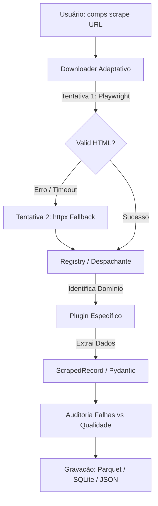

# O que sou? 🦕

> **Compsognathus** (ou simplesmente **`comps`**) v1.3.1 é um framework e CLI Python para coleta estruturada e auditável de dados web, orientado a plugins.
> 
> Ele cuida da infraestrutura complexa e repetitiva da raspagem de dados — downloads com navegadores headless, fallbacks resilientes HTTP, gestão de taxas e retentativas, validação de esquema via contratos fortes, auditoria de falhas e exportação analítica — para que você foque apenas na lógica de extração da página alvo.

---

## 🎯 A Filosofia e o Problema

Na raspagem de dados para ciência de dados e análises corporativas, a criação de scripts avulsos cria rapidamente um pesadelo de manutenção: fluxos sem retentativas confiáveis, concorrência descontrolada que aciona banimentos, formatos de saída inconsistentes e exceções silenciosas que estragam datasets gigantescos.

O **Compsognathus** se propõe a ser uma base de engenharia de dados, resolvendo essa bagunça através da **separação estrita de responsabilidades**:

- **O Framework (`comps`)** atua como plataforma corporativa leve: gerencia rede, resiliência térmica, validação de contratos (`ScrapedRecord`), relatórios estatísticos e pipeline de escrita de arquivos.
- **Os Plugins** são funções efêmeras que rodam injetadas e contêm puramente a regra de parsing específica de cada site.

Não se trata de uma ferramenta para "invadir" servidores ou contornar medidas severas de segurança de forma hostil. Pelo contrário: é uma fundação organizada, previsível e escalável para uso responsável, tolerando as intempéries transitórias da rede global.

---

## 💡 Decisões Técnicas e Arquitetura

Para entender este repositório sob a ótica de engenharia de software e arquitetura de dados, vale destacar os pilares de design:

### 1. Padrão de Plugin & Despacho Dinâmico (*Strategy Pattern*)

Em vez de um grande monolito (com múltiplos `if/else`), cada site suportado é isolado. O framework utiliza anotações (`@register`) para vincular uma função a um domínio. No momento da execução, a engine extrai a base da URL e despacha o parsing dinamicamente para a estratégia correta, mantendo desacoplamento total.

### 2. Resiliência de Download (Playwright + HTTPX)

Por ser voltado à precisão em ambientes modernos (SPAs), o Compsognathus prioriza o download mais garantido sobre o mais barato:

- **Camada 1 (Playwright):** Renderiza o Chromium Headless com flags que simulam um uso real e aguardam o conteúdo de JavaScript carregar, superando WAFs superficiais e páginas SPA.
- **Camada 2 (HTTPX):** Age como um fallback caso a inicialização ou o timeout da primeira tentativa excedam limites.
- Em paralelo, o **Tenacity** gerencia um *exponential backoff* com *jitter* no envio das URLs, espalhando picos e evitando o bloqueio primário de taxa (rate limits).

### 3. Validação e Qualidade de Dados Imediata

Não confiamos em scrapings silenciosos que retornam *None*.
Através do schema do **Pydantic v2**, cada `ScrapedRecord` é garantido contra o contrato. Se a árvore DOM ou a API subjacente do alvo mudar misteriosamente, a função não joga o dataset no lixo de vez: ela encerra as colunas corrompidas com uma *parse_error* preservando o dado incompleto. O comando `comps validate` pode investigar essas falhas posteriormente para que a manutenção seja cirúrgica e não destrutiva.

---

## ⚖️ Trade-offs Arquiteturais

| Decisão | Motivação | Trade-off / Preço Pago |
|---|---|---|
| **Plugins por domínio** | Isola as inevitáveis quebras de HTML frequentes de cada site, limitando o raio de ação. | A complexidade horizontal cresce; cada novo domínio exige sua própria função de parsing registrada. |
| **Playwright primeiro, depois HTTP** | Assegura que páginas dinâmicas ou blindadas tragam o DOM completo de primeira. | O navegador consome mais memória e recursos computacionais, sacrificando performance bruta extrema. |
| **Preservar registros com falhas** | Um erro em um nó não invalida um lote demorado. Mantém o pipeline de dados limpo para posterior reprocessamento/auditoria. | O dataset final pode incluir valores nulos em colunas essenciais se ignorados, forçando o uso de `comps validate`. |
| **Fixtures HTML sintéticas para os testes** | Os testes rodam 100% offline, de forma rápida, previsível, e livre de problemas de rede. | Testes não falharão se o site real for redesenhado; os mocks exigem testes rotineiros complementares no "mundo real". |

---

## ⚙️ A Stack Tecnológica

| Camada | Ferramenta | Responsabilidade |
| :--- | :--- | :--- |
| **Linguagem & Contratos** | Python 3.11+ / Pydantic v2 | Base com *Type Hints* rígidos e validação no tempo de execução. |
| **CLI & UX** | Typer + Rich | CLI imersiva e tipada; terminal colorido com diagnóstico de pipeline. |
| **Rede & Scrape** | Playwright / HTTPX / Tenacity | Camadas redundantes e retry com backoff contra WAF e Timeouts. |
| **Parsing** | BeautifulSoup 4 / Lógica Híbrida | Extração por JSON-LD, metatags, variáveis `__NEXT_DATA__` e CSS. |
| **Data Engineering** | Pandas + PyArrow | Escrita tabular eficiente (Parquet, SQLite, CSV, JSON Lines). |
| **Qualidade & CI** | Pytest / Ruff / Github Actions | Uma extensa e veloz suíte de testes (offline) validando contratos continuamente. |

---

## 🔄 O Fluxo Interno 

## Próximos Passos (Uso)

- Se você quer entender como instalar, rodar e exportar na linha de comando, acesse o passo a passo completo no [**DIDATICO.md**](DIDATICO.md).
- Se sua intenção for criar um módulo de extração para o seu próprio site de interesse, acesse o [**Tutorial de Criação de Plugins**](docs/writing-a-plugin.md).
