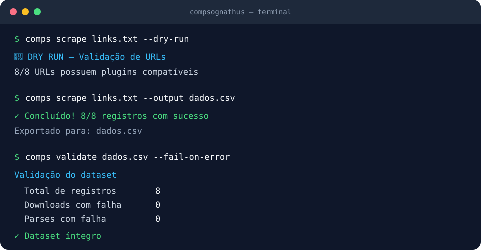

# Compsognathus 🦕

[](https://www.python.org/)
[](https://github.com/elycbarros/compsognathus/actions/workflows/tests.yml)
[](LICENSE)

**Compsognathus** (ou apenas `comps`) é um framework e CLI Python orientado a plugins para coleta estruturada e auditável de dados web. 

Ele deixa o trabalho repetitivo — tratar erros de rede, gerenciar retentativas anti-bloqueio, rodar navegadores headless, aplicar validação rigorosa de dados e exportar o dataset — a cargo do framework, para que cada plugin precise se concentrar apenas em extrair os dados específicos do seu domínio. Foi desenhado não como uma ferramenta isolada, mas como uma base sólida de engenharia de dados para preparação de informações para consumo posterior em análises ou automações.



## Capacidades Principais

- **Despacho dinâmico**: Plugins registrados por domínio, invocados automaticamente pela URL de origem.
- **Download resiliente e configurável**: Cada plugin pode escolher entre HTTPX e Playwright, definir timeouts e cabeçalhos, e reutilizar recursos durante o lote. Inclui *exponential backoff* nativo contra limites de requisições.
- **Extração limpa**: Foco em JSON-LD, payloads estruturados (como Next.js) e por último seletores CSS.
- **Validação de esquema**: O contrato de extração é checado por campos obrigatórios e, quando declarado pelo plugin, por um modelo tipado do Pydantic v2.
- **Trilha de auditoria**: Falhas de download ou extração não descartam o dataset, mas são preservadas para diagnóstico (`comps validate`).
- **Execuções recuperáveis**: `--job-dir` persiste o progresso, permite `--resume`, reutiliza HTMLs e registra recusas por `robots.txt`.
- **Controle responsável**: Concorrência e atraso podem ser limitados por domínio, com ajuste após erros e suporte a `Retry-After`.
- **Ecossistema extensível**: Plugins externos podem ser instalados como pacotes Python via entry points.
- **Manifesto de execução**: Cada coleta gera um `*.run.json` com configuração, métricas, plugins e erros resumidos.
- **Múltiplos Formatos**: Exportação embarcada para Parquet (padrão), CSV, JSON, JSONL e banco SQLite.

## Validação e Testes

O Compsognathus acompanha uma extensa suíte de testes (rodando offline via fixtures sintéticas HTML) para garantir confiabilidade sem spammar sites externos durante o CI. Além disso, as releases são validadas contra páginas reais anonimizadas antes do empacotamento, checando completude dos metadados e estabilidade dos componentes centrais.

## Início rápido

É necessário Python 3.11+ e o navegador Chromium (usado pelo Playwright).

```bash
git clone https://github.com/elycbarros/compsognathus.git
cd compsognathus

# Criação do ambiente virtual
python -m venv .venv
source .venv/bin/activate

# Instala o projeto, as dependências de execução e de testes
pip install -e ".[dev]"
playwright install chromium
```

Crie um arquivo `links.txt` com uma URL HTTP(S) válida por linha e execute:

```bash
# Confirme os plugins disponíveis sem acionar downloads
comps scrape links.txt --dry-run

# Raspe as URLs e exporte o dataset em Parquet (padrao)
comps scrape links.txt --output dados.parquet

# Inspecione a qualidade e completude da coleta
comps validate dados.parquet --fail-on-error
comps report dados.parquet --html relatorio.html
```

Você pode utilizar a concorrência e escolher diferentes saídas:

```bash
comps scrape links.txt --format sqlite --output dados.db --concurrency 3

# Coleta recuperável, com cache e retomada após interrupções
comps scrape links.txt --job-dir .jobs/minha-coleta
comps scrape links.txt --job-dir .jobs/minha-coleta --resume
```

## Documentação Completa

Para não sobrecarregar este arquivo, a documentação é dividida de acordo com sua finalidade:

- 🏗️ **Arquitetura e Design:** Para entender a separação de camadas, decisões técnicas, trade-offs e como a pipeline funciona sob o capô, consulte [`O_QUE_SOU.md`](O_QUE_SOU.md).
- 🚀 **Tutorial Executável:** Para um guia de execução do começo ao fim (geração de projeto e interpretação dos comandos e saídas), leia o guia de uso no [`DIDATICO.md`](DIDATICO.md).
- 🧩 **Extensão (Plugins):** O framework oferece um scaffolding automático de plugins, fixtures e testes. Para aprender a criar o seu, veja [`docs/writing-a-plugin.md`](docs/writing-a-plugin.md).
- 📝 **Histórico de Mudanças:** Para ver as atualizações e novos formatos implementados em cada release, visite o [`CHANGELOG.md`](CHANGELOG.md).

## Segurança e uso responsável

Compsognathus automatiza extrações técnicas. Respeite as políticas de rate-limit, o `robots.txt` e os Termos de Uso (ToS) dos sites raspados. O framework **não** contorna bloqueios rígidos baseados em *fingerprinting* complexo nem autenticações anti-bot, e os dados devem ser consumidos e anonimizados dentro das leis aplicáveis. Se você reportar uma vulnerabilidade na própria ferramenta, utilize uma abertura de issue de segurança de forma privada no repositório.

## Licença

Compsognathus é software de código aberto e liberado sob a licença [MIT](LICENSE).
